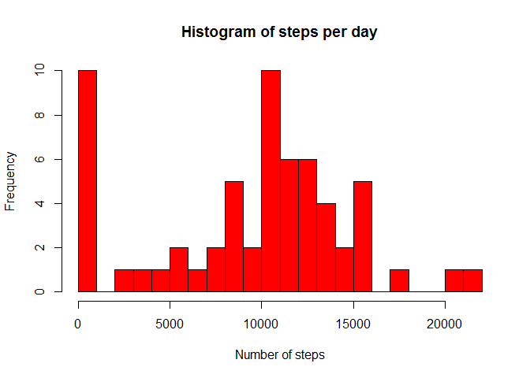
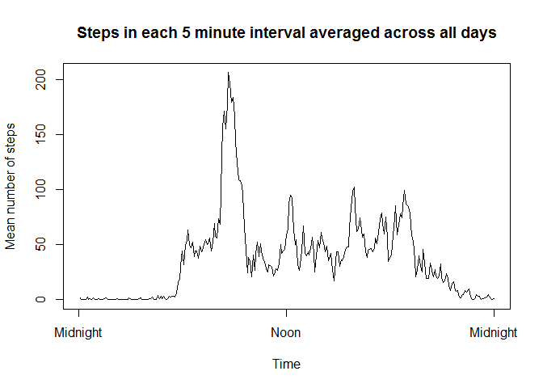
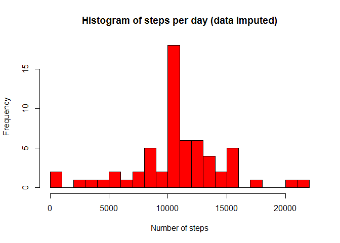
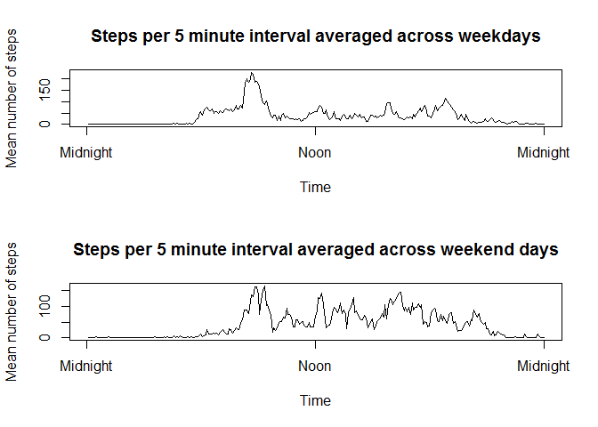

# Reproducible Research: Peer Assessment 1


## Loading and preprocessing the data


```r
options(scipen=999)
library(reshape)
activity <- read.csv("activity.csv")
activity$date <- as.Date(activity$date)

activity1 <- cast(melt(activity,id="date",na.rm=T),fun.aggregate=sum)
hist(activity1$steps, col="red", xlab="Number of steps", 
     main = "Histogram of steps per day", breaks = 25)
```

<!-- -->


## What is mean total number of steps taken per day?


```r
mean_steps <- mean(activity1$steps)
median_steps <- median(activity1$steps)
```

The mean number of steps is 9354.23.
The median number of steps is 10395.


## What is the average daily activity pattern?


```r
activity2 <- cast(melt(activity,id="interval",na.rm=T),fun.aggregate=mean)
plot(activity2$steps, xlab="Time", ylab="Mean number of steps", main=
       "Steps in each 5 minute interval averaged across all days", type="l",xaxt="n")
axis(1, at=c(0,144,288),labels=c("Midnight", "Noon", "Midnight"))
```

<!-- -->

```r
max_interval <- activity2$interval[which.max(activity2$steps)]
```

The interval which has on average the greatest number of steps is 835.


## Imputing missing values

```r
na_count <- sum(is.na(activity$steps))
```

There are 2304 missing values. I will impute them by replacing them with the mean number of steps for their respective time intervals.


```r
activity3 <- activity
for (i in 1:length(activity$steps)){
  if (is.na(activity3$steps[i])){
    activity3$steps[i] <- activity2$steps[which(activity2$interval==activity3$interval[i])]
  }
}
activity4 <- cast(melt(activity3,id="date",na.rm=T),fun.aggregate=sum)
hist(activity4$steps, col="red", xlab="Number of steps", 
     main = "Histogram of steps per day (data imputed)", breaks = 25)
```

<!-- -->

```r
mean_impute <- mean(activity4$steps)
median_impute <- median(activity4$steps)
```

Now the mean is 10766.19 and the median is 10766.19, which are both greater than they were before the missing values were imputed.
The histogram shows that this method of imputing values has removed the peak at the low end with a high peak in the middle.

## Are there differences in activity patterns between weekdays and weekends?


```r
activity3$date <- weekdays(as.Date(activity3$date))
activity3$Day_type <- ifelse(activity3$date %in% c("Monday","Tuesday", "Wednesday",
            "Thursday", "Friday"), "Week", "Weekend")
par(mfrow=c(2,1))
activity5 <- cast(melt(activity3[which(activity3$Day_type=="Week"),c(1,3)],id="interval",na.rm=T),fun.aggregate=mean)
plot(activity5$steps, xlab="Time", ylab="Mean number of steps", main=
       "Steps per 5 minute interval averaged across weekdays", type="l",xaxt="n")
axis(1, at=c(0,144,288),labels=c("Midnight", "Noon", "Midnight"))
activity6 <- cast(melt(activity3[which(activity3$Day_type=="Weekend"),c(1,3)],id="interval",na.rm=T),fun.aggregate=mean)
plot(activity6$steps, xlab="Time", ylab="Mean number of steps", main=
       "Steps per 5 minute interval averaged across weekend days", type="l",xaxt="n")
axis(1, at=c(0,144,288),labels=c("Midnight", "Noon", "Midnight"))
```

<!-- -->

On the weekends, more steps are taken in the middle of the day than on weekdays.

